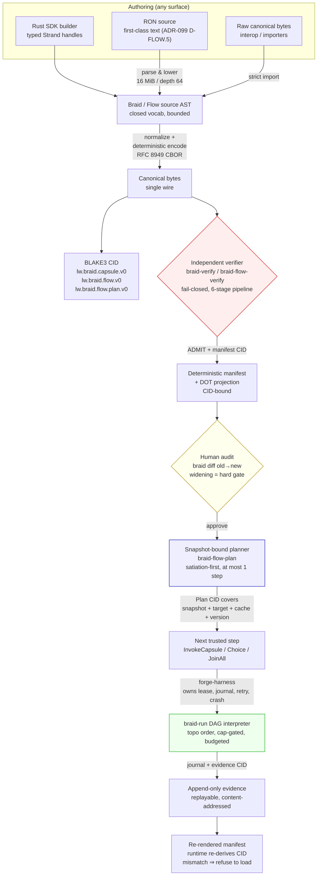
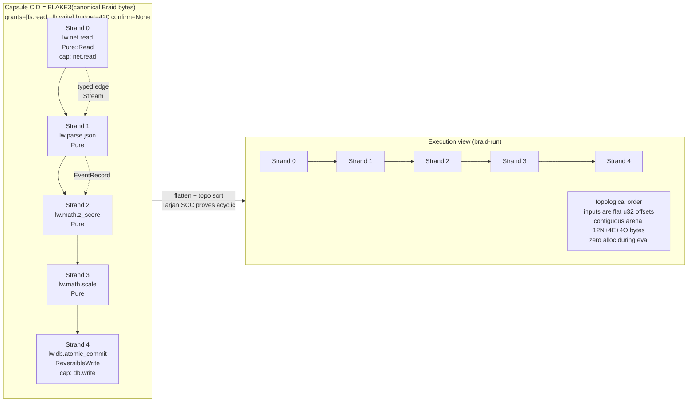
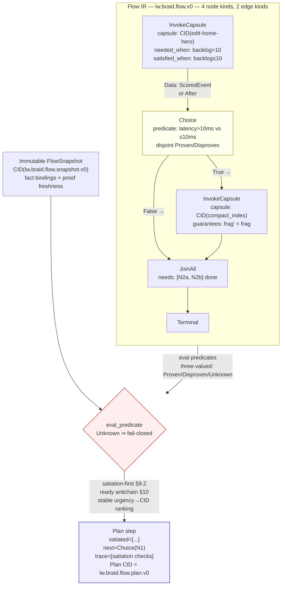
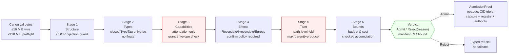
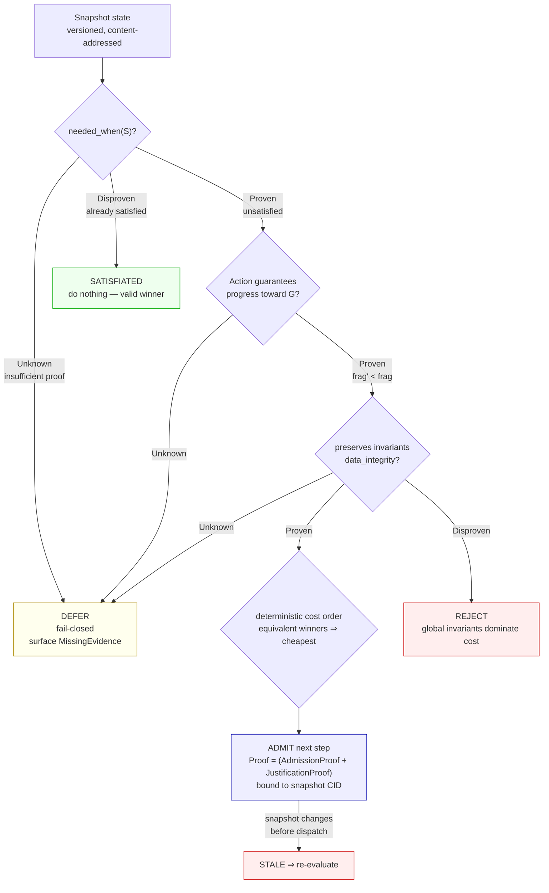
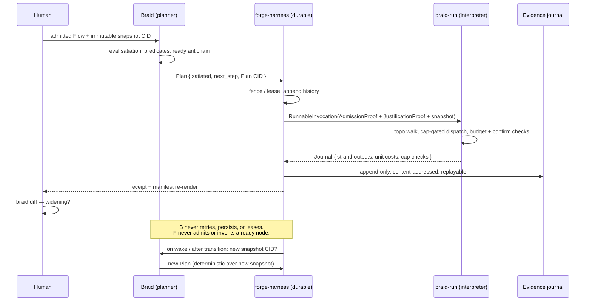

# Braid — End-User Strategic Vision

**Status:** DRAFT for Director review — 2026-08-28
**Audience:** human product owner / specialist auditor / AI agent operator
**Authority:** ADR-088 (machine-first framework), ADR-099 (frontier Flow), ADR-100 (elaboration seam), Constellation Charter
**Scope:** what an end user sees, owns, and verifies — not crate internals

---

## 1. One-sentence promise

**AI authors code as data; humans own design as a rendered manifest; a deterministic verifier owns the safety floor. No human review can be bypassed, no AI prompt can mint authority, and every production decision is replayable from its content hash.**

Braid is not a framework you rewrite your app for. It is a compiler and gate you put *between* authoring and execution. If the gate does not admit it, it does not run — on any machine, in any workspace, for any tenant.

---

## 2. Who the end user is

| Actor | Owns | Sees | Cannot do |
|---|---|---|---|
| **Human specialist / Director** | architecture, intent, capability grants, budgets, confirmation policy, vocabulary choice | CID-bound manifest, diff, DOT projection, journal evidence | cannot be bypassed by an AI prompt; confirmation is a hash-bound gate, not a button |
| **AI coder / architect agent** | authoring — Rust SDK, RON source, or raw bytes | typed verifier verdicts (`REJECT` with reason, not "try again") | cannot invent authority, cannot execute, cannot persist state |
| **Verifier (braid-verify / braid-flow-verify)** | admits or rejects — no discretion, no fallback | canonical bytes only | cannot be coerced by author |
| **Runtime (braid-run) + forge-harness** | executes exactly one admitted capsule/plan step under a snapshot | journaled evidence, Plan CID | cannot execute the unadmitted |

The law that governs every change is `AGENTS.md: Production Engineering Law` — multi-tenant, hostile input, retries, restarts, bounded resources, version skew. A feature that works only for one user on one machine is a fixture, not the product.

---

## 3. End-to-end data-flow — the five DAGs

### 3.1 System-level lifecycle (the only path to production)

Every artifact reaches production through the same six gates. There is no second wire format, no side door, no "internal" build.



**Invariants that never break:**
- `only known-good may execute` — `Unknown` never authorizes.
- `no second wire` — RON/JSON/YAML spelling differences never fork identity.
- `snapshot-bound` — stale proof invalidated on state change.
- `separation of authority` — Braid never mints capability; kernel does.

---

### 3.2 Inner capsule DAG — the computation graph (what the AI authors)

One capsule is a DAG of **strands** (one typed term application). Edges are typed value flows. The graph is immutable, content-addressed, and branchless at execution.



**Lowering pipeline (from `BRAID-GRAPH-DSL.md`):**
`Graph DSL / subgraph / fan-in` → hierarchical flatten → Tarjan SCC (acyclic proof except bounded `~>`) → linear strand schedule → static offset plan → contiguous buffer → SIMD-friendly evaluation.

Each strand declares `inputs: [u32]` as offsets into the flat arena, not per-strand allocations (ADR-101 compact projection).

---

### 3.3 Outer Flow DAG — wiring capsules into justified work (what the human designs)

The outer graph does **not** inline capsule internals. It invokes already-admitted capsules by CID, gated by three-valued predicates.



**Trust split (ADR-099 D-FLOW.1):**
- Braid owns: semantic Flow AST/IR, canonical encoding, Flow CID, independent static admission, deterministic snapshot-bound frontier derivation.
- forge-harness owns: durable instance, lease/fencing, event history, workers, retries, crash recovery, evidence persistence, receipts. Braid emits *at most one sequential next step*; it does not schedule, persist, or retry.

Closed v0 kinds: `InvokeCapsule`, `Choice`, `JoinAll`, `Terminal` — no `JoinAny`, no races, no unbounded `MapStatic` (expands before encoding). Edges are `Data` (typed capsule port) or `After`.

---

### 3.4 Verification pipeline — six fail-closed gates (the safety floor)

Every byte passes through independent stages in order. Any stage may REJECT with a typed reason; forgiving at authoring, uncompromising at gate.



**Boundary guarantee:** substrate crates `braid-ir / braid-verify / braid-capability` fail the build if an unapproved dep or import appears (`crates/braid-ir/tests/boundary_conformance.rs`, `lgwks-std-gate`).

---

### 3.5 Justified invocation — the triad gate (why a call exists at all)

The most distinctive product property: **a safe, authorized, correctly implemented function may still be the wrong invocation**. Execution requires the conjunction:

```
Run(f,S,G) ⇔ Safe(f,S) ∧ Authorized(f,S) ∧ Justified(f,S,G)
```

where `S` is the immutable snapshot and `G` is the declared `satisfied_when`.



**Three-valued logic is the product:** `Proven / Disproven / Unknown`; `Unknown` never executes or satiates. The `satisfied_when` predicate makes *doing nothing* a first-class, auditable winner. The proof binds to the exact snapshot CID and is invalidated on state change — no check/use race.

Evidence: `braid-flow-plan` evaluation is total, stable, and CID-bound; `braid-verify` AdmissionProof binds capsule/registry/authority CIDs; `braid-run` RunnableInvocation consumes both proofs and has no raw-capsule public entry.

---

### 3.6 Durable execution — forge-harness owns the lifecycle (Braid owns the decision)

Braid derives the trusted next step; forge-harness makes it durable.



If the instance crashes mid-step, forge-harness resumes from the fenced history and asks Braid for a plan under the exact snapshot — it cannot bypass admission or invent readiness.

---

## 4. End-user journeys (the real product paths)

### Journey A — AI authors, human audits, capsule ships

```
AI (SDK/RON) → elaborate → canonical bytes → braid verify
    → REJECT(typed reason: missing cap / effect without confirm / taint) → AI re-authors from reason
    → ADMIT → braid render → manifest + DOT
    → human: braid diff base→new → approve (or reject widening)
    → braid-run (proof-gated) → journal → evidence CID
```

The AI loop is two-state: `AttemptPlan` → `FailureRequiresFix` → `RecoveryImpact`. The typed refusal is the API; there is no "confidence score" — the LLM either addresses the refusal or the artifact never ships.

Real gates exercised: laundering capsule REJECT at taint (hostile case), irreversible publish without confirm REJECT at effect, seeded widening flagged in CI (`scripts/cli-loop.sh`, T12).

### Journey B — Flow orchestrates multiple capsules with justification

```
Human designs Flow (Invoke/Choice/JoinAll) in RON
  → braid-flow-verify admits structure, predicates bounded
  → snapshot: { backlog: 34, latency: 7ms }
  → plan: satiation? no → ready antichain = [compact_index] → next=InvokeCapsule(CID...)
  → RunnableInvocation(AdmissionProof + JustificationProof) → braid-run executes one capsule
  → new snapshot { backlog: 3, latency: 7ms }
  → next plan: satisfied_when(backlog≤10) Proven → satiated → do nothing wins
```

Doing nothing is the product: the same Flow that authorized work now deterministically refuses it.

### Journey C — Hostile / malformed / resource-exhaustion path

Every hostile input is a typed rejection, not a panic, not a silent fallback:

- Unknown capability → `MissingCapability` / `UnregisteredCrate` (boundary gate)
- Float smuggled → `Rejected at canonical-form`
- `let _ =` / `.ok()` swallowed → `swallow-budget ≤5` CI gate
- Massive wire → 16 MiB / 128 MiB preflight, 262k Value node ceiling
- Unknown justification → `UnknownProof` fail-closed; registry transplant → `InvalidRunnableProof`

Evidence: `cargo test --workspace --all-targets` (225+ suites today), `cargo clippy -- -D warnings`, `cargo fmt --check`, `lgwks_std_gate`, plus KAT vectors and mutation-ledger prover for anti-dredging.

### Journey D — Day-0 CMS reference (shipped)

Three real capsules, not fixtures, modeled on `blueprints/afternow-port`:

- `edit-home-hero` (reversible, local) — ADMIT
- `publish-services` (irreversible, HumanConfirm) — ADMIT
- `publish-services-noconfirm` (escalation probe) — AUTHOR-REFUSED at build time (exit 2, `ConfirmRequired`)

Evidence bundle regenerable via `scripts/demo-port.sh`, verified in `scripts/cli-loop.sh`, CIDs pinned and parity-checked.

---

## 5. What the manifest shows an auditor (the review surface)

The manifest is CID-bound and re-derivable by the runtime — mismatch ⇒ refuse to load.

- Intent and work-object binding
- Full capability list (capability names are dotted tokens, e.g., `db.write`)
- Effect classes present, with `Irreversible`/`Egress` highlighted
- Bounds, budget, confirmation and evidence policy, version pins
- Flow nodes, edges, predicates, guarantees, satiation trace
- Widening vs narrowing classification against previous manifest (CI gate)

Review is a diff, not a free-form read. A capability-widening PR is red-teamed in CI to prove the gate fires.

---

## 6. Architecture placement — where Braid sits in the constellation

```
AI / SDK / RON  ──authors──▶  Braid Flow SDK (parse → normalize → canonical)
                                         │
                                         ▼
                              Braid Flow IR  (lw.braid.flow.v0)
                              Braid Flow Verify (independent admit)
                                         │
                                         ▼
                              Braid IR (lw.braid.capsule.v0)
                              Braid Verify (independent admit)
                              Braid Render (manifest + DOT)
                                         │
                              ┌──────────┴──────────┐
                              ▼                     ▼
                    Braid Project        Braid Integrator
                    (multi-capsule,      (repo-graph advisor,
                     deterministic         proposes lgwks_std seams,
                     project CID)          never verifies)
                                         │
                                         ▼
                              Braid Flow Plan (snapshot-bound frontier)
                                         │
                              ┌──────────┴──────────┐
                              ▼                     ▼
                    braid-run (one capsule,          forge-harness
                    topo, cap-gated)                 (durable instance,
                                                     journal, lease, retry)
```

**Authority owners (Charter G2):**
- Braid: `Cid` (BLAKE3, `cid.rs`) + canonical bytes + term vocabularies.
- kernel: capability envelope, assignment record.
- forge-harness: receipt, work-object lifecycle.
- Braid never claims `Capability`, `Verdict`, `Fact`, `Principal`, `Receipt`, `WorkObject`.

Consumers path-dep `braid-ir` + `braid-vocab-cms`; browser vendored snapshot is deprecated on next publish (Charter Step 3).

---

## 7. Strategic roadmap — end-user-visible milestones

| Milestone | End-user outcome | Verifiable gate |
|---|---|---|
| **v0 — verified substrate (DONE)** | typed IR, verifier, render, CLI loop, budget/taint/confirm gates | 225+ tests, KATs, bijection fuzz, seeded widening red-team |
| **v0.1 — language frontends** | `braid-elaborate-js` (expression → statement, identifiers, lexical scope), golden/refusal corpus | pinned CIDs, depth-bound refusal, mutation guards |
| **v0.2 — project build** | `braid-project build` — elaborate + admit all caps, fail-closed, deterministic project CID | `cargo test -p braid-project` |
| **v0.3 — frontier Flow (NOW)** | `braid-flow-ir` + `braid-flow-verify` + `braid-flow-plan` + `braid-run` runnable proof typestate | 8 plan invariants, 9 runnable proofs, snapshot-bound refusal, registry transplant rejection |
| **v1 — first live consumer** | kernel or browser consumes published crate, collapses parallel enum, live API is Braid | `use braid_ir::Capsule` in downstream repo, not just `Cargo.toml` |
| **v1.1 — publish discipline** | crates publishable, semver on `Cid`/encoding breaks (G4 charter gate) | `cargo publish --dry-run` for all `braid-*` |
| **v1.2 — vocabulary scale** | `braid-vocab-*` covers real product surface (not just expressions) | literal payloads (D8), ported vocabularies |
| **v2 — durable orchestration** | Flow steps execute under forge-harness with evidence journals, deterministic replay | forge-harness #123 closed, cross-repo performance proof (10× vs re-execution) |

Non-goals remain locked per D6: textual surface syntax beyond RON/JSON interop, new storage/crypto, ML in admission path, package registry/FFI — until a ratified ADR says otherwise.

---

## 8. Why this vision is falsifiable (not marketing)

Every claim above is tied to a command that either passes or it does not:

```bash
cargo check --workspace
cargo test --workspace --all-targets
cargo clippy --workspace --all-targets -- -D warnings
cargo fmt --all -- --check
scripts/cli-loop.sh target/debug/braid
scripts/demo-port.sh target/debug/braid
cargo test -p braid-flow-plan --test plan_invariants
cargo test -p braid-run --test execution   # RunnableInvocation proofs
cargo test -p braid-ir --test boundary_conformance
```

A new `braid-verify` or `braid-flow-verify` change that breaks a KAT or bijection, a widening that CI does not flag, a swallowed error that pushes `let _ =` past 5, an unapproved dep that slips `lgwks_std_gate`, or a plan that dispatches under `Unknown` — all are build-red, not opinion-red.

---

## 9. Glossary — the ten terms an end user needs

- **Strand** — one typed term application (registered operator + signature + cap + cost).
- **Braid** — DAG of strands; composition legal only if types unify and authority attenuates.
- **Capsule** — braid + intent + grants + bounds + confirm/evidence policy; the admitted artifact.
- **CID** — BLAKE3 hash over canonical bytes; domain `lw.braid.*`; the identity.
- **Manifest** — deterministic rendering of an admitted capsule/Flow; the audit object.
- **Verifier** — independent, fail-closed admission pipeline; never co-located with authoring.
- **Flow** — outer DAG of capsules (`InvokeCapsule`, `Choice`, `JoinAll`, `Terminal`).
- **Snapshot** — immutable, content-addressed fact bindings; proofs are bound to it.
- **Plan** — satiation + at most one ready step; Plan CID covers all inputs.
- **Justification** — `needed_when / satisfied_when / guarantees / preserves / cost_order`; `Unknown` never executes.

---

## 10. How to start (for a team adopting Braid today)

1. **Read the audit surface:** `cargo run -p braid-cli -- render <capsule.braid>` and `diff`.
2. **Wire the advisor:** `cargo run -p braid-integrate -- --json` in your repo; apply proposed `lgwks_std` seams.
3. **Author a capsule:** Rust SDK → `braid-cli encode → verify → render`. Keep the `REJECT` reason — it is the API.
4. **Hold the widening gate:** add `scripts/cli-loop.sh` to your CI; seed a widening and watch it fail.
5. **When ready for orchestration:** author Flow in RON → `braid-flow-verify` → `braid-flow-plan` → `RunnableInvocation` → `braid-run`. Do not persist Flow state in Braid.

---

*This vision is additive to `AGENTS.md` Production Engineering Law and the Constellation Charter. Where a repo-local doc contradicts the charter, the charter wins. License: BSD-3-Clause.*
