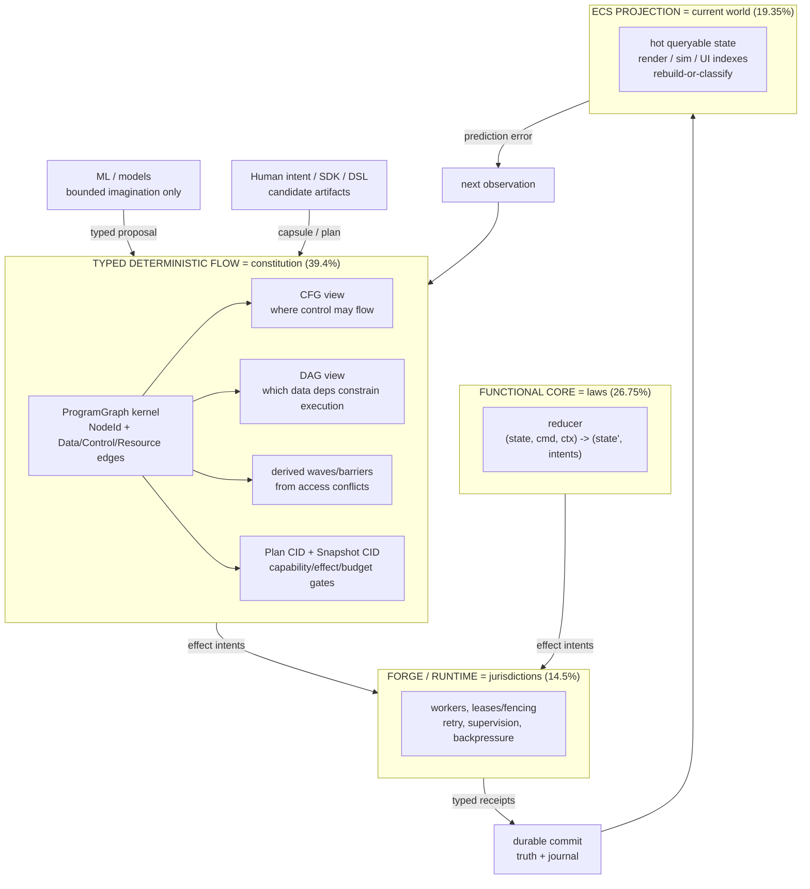

# Ideation: Braid Paradigm Authority

> Post-PR98 (`59e9656` unified ProgramGraph M0+M1), the four paradigms do not compete for one runtime. They own different questions. These 7 survivors say what to build first, in what order, and what each layer is forbidden from owning.

## Grounding Context

**Codebase context — Braid shape today [read]:**

- `braid-ir` typed term-graph IR, canonical CBOR-subset, BLAKE3 CIDs (`lw.braid.*`), one-byte admission triad; `braid-verify` 8 fail-closed stages; `braid-render` CID-bound manifest + DOT; `braid-sdk` Builder with typed refusals; `braid-cli` encode/decode/verify/render/diff.
- `braid-flow-ir` bounded `FlowSpec` DAG (`InvokeCapsule`/`Choice`/`JoinAll`/`Terminal`, `JustificationDecl`, disjointness-proven predicates); `braid-flow-plan` snapshot-bound deterministic satiation (Plan CID, Snapshot CID); `braid-run` sequential topological DAG execution, capability/budget/confirmation gates, append-only journal.
- PR98 added `braid-ir::graph::ProgramGraph` (stable `NodeId`, `GraphNodeKind`, typed `Data`/`Control` edges, deterministic `cfg()`/`dag()` projections, fail-closed checks) as migration kernel; `Braid`/`Strand` + `FlowSpec` remain compatibility forms. Resource/effect conflict edges deliberately deferred.
- Constraints: charter G2 (no second `Capability`/`Verdict`/`Principal`), sole `Cid` authority here, D6 gated general grammar, D8 (no floats, canonical bytes), D9 independent decoder, triad `Safety x Capability x Justification` with `Unknown` fail-closed.
- Pain: `EffectClass` names danger, not touched state (`#97` P1); `Host::call` returns bare `Value`, no receipt (`#97` P1); sequential topo hides safe concurrency (`#97` P2); two graph authorities drift (PR98).

**Directive refs:** GH `#97` (resource-qualified access contracts + acceptance evidence) and `#99` (bounded-agency doctrine, authority weights `E 19.35 / F 26.75 / D 39.40 / A 14.50` as design prior, P0–P6 decomposition) — treated as constraints, not proposals-recorded-as-fact.

**External context [ran: 9Router fetch-combo + search-combo this session, retrieved 2026-09-03]:**

- `bevy_ecs` docs (`https://docs.rs/bevy_ecs/latest/bevy_ecs/`): "Bevy ECS can use function parameter types to determine what data needs to be sent to the system. It also uses this `data access` information to determine what Systems can run in parallel" and "The built in `parallel executor` considers dependencies between systems and (by default) run as many of them in parallel as possible." Verified precedent for deriving safe parallelism from declared access — survivor 1's waves are the same move under deterministic admission.
- Flecs README (`https://github.com/SanderMertens/flecs`): "a fast and lightweight Entity Component System that lets you build games and simulations with millions of entities." Verifies the dense-entity bulk-iteration shape ECS owns — survivor 5's benchmark must test exactly this against an actor-per-entity baseline.
- Erlang/OTP supervision (`https://www.erlang.org/doc/design_principles/sup_princ.html`): supervisors start/stop/monitor children, restart on failure per strategy (`one_for_one`, `one_for_all`, `rest_for_one`) with bounded restart intensity (`intensity`/`period`). Verifies the supervision-with-bounds pattern survivor 6 ports to the Forge boundary.
- Temporal durable execution (`https://temporal.io/how-temporal-works`): workflow state "durable and fault tolerant by default" so logic "can be recovered, replayed or paused from any arbitrary point"; failure-prone logic lives in Activities "orchestrated by the Workflow" with retry policy. Verifies the workflow-vs-activity ownership split survivor 6 mirrors (Braid admits, Forge executes/retries) — Temporal's own canonical example is moving money between bank accounts.
- Model predictive control (`https://en.wikipedia.org/wiki/Model_predictive_control`): "optimizing a finite time-horizon, but only implementing the current timeslot and then optimizing again, repeatedly." Verifies survivor 7's receding-horizon discipline is established control practice, not a new invention.
- Lean (`https://lean-lang.org/about/`): "Lean's minimal trusted kernel guarantees absolute correctness" with metaprogramming/elaboration outside it. Verifies the small-kernel pattern; Braid's D21 seam + PB-03 already apply it, so it stays a rejection (already present), now cited.
- Kubernetes admission (`https://kubernetes.io/docs/reference/access-authn-authz/admission-controllers/`): controllers "intercept requests to the Kubernetes API server prior to persistence," validating/mutating, with webhook extension points. Verifies the characterization behind rejection row 14: webhook-style add-on admission exists elsewhere; Braid's locked single verifier path is the deliberate contrast.
- No-signal probes (not used as basis): arXiv `all:electron` returned unrelated condensed-matter results; the ECS-vs-Actor web search returned titles with empty snippets (not cited); AI-news probe returned 2026-09-03 headlines, irrelevant to this topic.

**Adjacent prior:** `docs/ideation/2026-08-31-excellent-declarative-experience.md` (declarative UX surface; this doc decides the authority underneath it).

## Topic Axes

- X1 Deterministic admission & causal order
- X2 Functional meaning & legal transitions
- X3 Hot projection & bulk interaction
- X4 Isolation, lifecycle & failure containment
- X5 Authoring, agency & auditability

## Candidate Architecture Graph

The whole proposal in one picture: `ProgramGraph` is the constitution; everything else is a question-owner around it. Prose below the graph is authoritative; the graph only accelerates it.

Reading rules (the nonclaims that keep this honest): deterministic means admission/planning/reduction over declared inputs — clocks, networks, and filesystems stay nondeterministic and are bounded via receipts, fencing, and replay classes. No model output touches state except through the same admission path as human artifacts, one bounded commit at a time. A projection mutation is never durable truth; durable truth is a committed fact that projections rebuild from.

## Ranked Ideas

### 1. Access contracts in canonical bytes, conflicts derived, waves emitted
**Description:** Extend `TermSpec` with registry-bound `ResourceKey` + `Read/Write/Append` access sets included in canonical encoding (so registry CIDs move when contracts move). The verifier rejects undeclared/duplicate/contradictory/unbounded sets; the planner derives value edges *and* state-conflict edges and emits deterministic execution waves/barriers; DOT/manifest gains value/read/write/append/effect edge kinds. This is `#97` requirements 1–3 plus its acceptance row (disjoint writes share a wave; conflicts order or reject) in one shippable slice.
**Axis:** X1 Deterministic admission & causal order
**Basis:** `direct:` "`TermSpec` declares `Pure | Read | ReversibleWrite | Irreversible | Egress`, but there is no stable resource/component identity or declared read/write set" (`#97` P1); "`Resource` edges are derived from declared system access contracts, not hand-authored scheduling hints" (`spec/braid/CANDIDATE-ARCHITECTURE.md` §3). `external:` Bevy ECS derives runnable-in-parallel sets from systems' declared data access (`docs.rs/bevy_ecs`, verified above) — same mechanism, ported under fail-closed admission.
**Rationale:** One declaration feeds admission, scheduling, rendering, CID binding, and audit — every other survivor consumes its output, so it goes first.
**Downsides:** Touches canonical encoding and every registry CID; needs KATs proving old-registry behavior rather than silent reinterpretation; medium-size verifier + planner change.
**Confidence:** 85%
**Complexity:** Medium

### 2. Ratify the constitution: ADR + narrowed determinism + ratio-as-prior
**Description:** Merge one ADR + append-only decision-register entry defining bounded agency ("make the system immediate and predictive without letting prediction, scheduling, or isolated workers become independent authorities over durable reality"), the four authority layers with forbidden-authority lists, the narrowed determinism claim, and the `19.35 : 26.75 : 39.40 : 14.50` split explicitly labelled a falsifiable design prior — explicitly stating Braid becomes no universal ECS world, actor runtime, durable scheduler, or state database. Cross-links `#56`/`#97`.
**Axis:** X1 Deterministic admission & causal order
**Basis:** `direct:` "`#99` P0 — ratify doctrine only" task list (ADR, decision entry, cross-links, nonclaims, ratio-labelled-as-prior); PR98 deliberately "does not pretend parallel execution is safe yet" — doctrine must say so before code does.
**Rationale:** Locks the vocabulary every later argument uses; without it each workstream re-litigates which paradigm owns what.
**Downsides:** Docs-only value until enforced; ratio invites misreading as benchmark — must repeat the prior-not-evidence label everywhere it appears.
**Confidence:** 80%
**Complexity:** Low

### 3. Split the host boundary into five stages that cannot collapse
**Description:** Replace the single `Host::call -> Result<Value>` with five typed stages — pure returned value, read observation, requested effect (intent), executed effect receipt, committed durable fact — each with its own type, so no Boolean "success" can launder them together. Effect adapters return content-bound receipts (term CID + resource/object identity + before/after or inverse + host witness + replay class); the journal commits access sets + receipts, not declared class + output. A host cannot report effect success without a matching typed receipt.
**Axis:** X2 Functional meaning & legal transitions
**Basis:** `direct:` "The host receives a term ID, values, and `TermSpec`, then returns only a `Value`. Nothing structurally proves that a `Read` term did not mutate state" (`#97` P1); "`Host::call` returns only `Result<Value, ExecutionError>`" vs the five target stages (`#99` boundary types).
**Rationale:** This is the structural anti-hallucination move: undeclared effects become unrepresentable instead of merely forbidden.
**Downsides:** Every host adapter changes shape; reversible/inverse capture may be unavailable for some effects (needs the non-replayable classification done well, not as an excuse).
**Confidence:** 78%
**Complexity:** Medium

### 4. One bounded functional reducer before any universal wire
**Description:** Implement exactly one vocabulary-level typed reducer/state machine — `(old typed state, typed command, explicit context) -> Result<(new typed state, effect intents), typed refusal>` — proving illegal states unconstructable (or fail-closed) and that reducers return intents instead of executing. Property + KAT tests pin deterministic transitions. No universal reducer wire until this reference workflow demonstrates the need.
**Axis:** X2 Functional meaning & legal transitions
**Basis:** `direct:` "`#99` P3 — do not add a new universal reducer wire merely to satisfy this issue. First prove the contract in a bounded vocabulary/reference workflow."
**Rationale:** Cheapest way to prove the F-layer contract with production-law discipline (two identities, hostile/malformed input, version skew) before generalizing.
**Downsides:** Reference-workflow scope can creep into framework-building by another name; needs an ADR scoping it as reference, not kernel.
**Confidence:** 72%
**Complexity:** Medium

### 5. Projection adapter contract: rebuild-or-classify, then benchmark
**Description:** Define the downstream ECS-style adapter that materializes hot current state (windows, cells, render nodes, task indexes) *only* from committed facts/receipts, with a deterministic-rebuild proof for the same snapshot or an explicit typed non-rebuildable classification. Benchmark dense bulk updates against an actor-per-entity baseline to earn the ECS projection claim empirically. Braid carries contracts + evidence; the mutable projection lives downstream.
**Axis:** X3 Hot projection & bulk interaction
**Basis:** `direct:` "`#99` P4 — prove deterministic rebuild for the same snapshot, or emit a typed non-rebuildable classification"; `external:` Flecs builds "games and simulations with millions of entities" on ECS iteration (`github.com/SanderMertens/flecs`, verified above) — the dense extreme the benchmark must reproduce before the projection claim is earned.
**Rationale:** Gives ECS its real job (hot current world) while structurally preventing the second-mutable-world failure.
**Downsides:** Benchmarks can be gamed by workload choice — must run both extremes (dense particles, sparse idle rooms); rebuild proofs are real work per adapter.
**Confidence:** 68%
**Complexity:** Medium

### 6. RunnableInvocation adapter + the fault matrix at the Forge boundary
**Description:** One Forge/sandbox worker adapter consumes `RunnableInvocation` with zero admission authority of its own, proven against crash-before-effect, crash-after-effect-before-receipt, retry/duplicate delivery, stale lease, and out-of-order message cases via fencing/idempotency contracts. A money-like reference workflow (functional legal states + deterministic flow + transactional commit + actor isolation) is the composition demo. Confirms no second planner, verifier, receipt type, or durable history appears.
**Axis:** X4 Isolation, lifecycle & failure containment
**Basis:** `direct:` "`#99` P5 — test crash-before-effect, crash-after-effect-before-receipt, retry, duplicate delivery, stale lease, and out-of-order message cases"; per `#56`, durable instances/workers/leases/retries/recovery stay Forge-side. `external:` Erlang supervisors restart children per strategy with bounded `intensity`/`period` (`erlang.org` supervision principles, verified above); Temporal splits durable Workflow from retried Activities and uses bank-account money movement as its canonical example (`temporal.io/how-temporal-works`, verified above).
**Rationale:** Actors earn their keep exactly here — fault containment with fencing — and the boundary test is where "bounded agency" either holds or is theater.
**Downsides:** Needs a real Forge/runtime counterpart to test against; fault-injection harness is the bulk of the work, not the adapter.
**Confidence:** 66%
**Complexity:** Medium

### 7. The predictive loop: model proposes, Braid disposes, world re-observes
**Description:** Reference controller where a model emits only typed candidates (`proposal/hypothesis/preview/candidate plan/confidence/bounded intent`); functional logic evaluates meaning; Braid admits and justifies exactly one bounded action against an immutable snapshot; runtime executes with fencing; receipt + outcome commit; projection updates only after commit; the remaining horizon re-plans on new observation. Low confidence / `Unknown` performs no durable effect without an explicit escalation rule. Preview state is typed-distinct from committed state.
**Axis:** X5 Authoring, agency & auditability
**Basis:** `direct:` "Only the first bounded action should be eligible for commitment before re-observation" with `Truth_{t+1} = Commit(Truth_t, a_t, receipt_t)` (`#99` control loop); forbidden path "ML output ─X→ canonical state mutation" (`#99`). `external:` model predictive control optimizes "a finite time-horizon, but only implement[s] the current timeslot and then optimiz[es] again, repeatedly" (Wikipedia, verified above).
**Rationale:** This is the "truly cognizant" differentiator made safe: speculation over cheap reversible futures, commitment of one constrained step — the fluid-predictive-interface analogue.
**Downsides:** Largest scope; depends on survivors 1–3 and 6 existing first; confidence-gating policy is easy to get wrong (over-escalation = helpless system, under-escalation = unbounded agency).
**Confidence:** 62%
**Complexity:** High

## Rejection Summary

| # | Idea | Reason Rejected |
|---|------|-----------------|
| 1 | DOT/manifest state-edge rendering as standalone | Folded into survivor 1 — rendering without the declarations is decoration |
| 2 | Registry-CID-binds-contracts + old-registry KATs as standalone | Folded into survivor 1 — acceptance evidence of the same slice, not a direction |
| 3 | Undeclared-access fail-closed reference host as standalone | Folded into survivor 1 — one acceptance test inside the slice |
| 4 | Replay-classification of host mutations as standalone | Folded into survivor 3 — belongs to the receipt type, not its own idea |
| 5 | Finish ProgramGraph migration / retire dual authorities | Already covered by `spec/braid/PLAN-UNIFIED-GRAPH.md` M2+ — not a new direction |
| 6 | Verifier independently admits the schedule | Folded into survivors 1+3 — mechanism detail for brainstorm, not ideation-level |
| 7 | Versioned-reads-only host rule as standalone | Folded into survivor 1 — one invariant of the access contract |
| 8 | Auto-derived state-impact index as standalone | Folded into survivor 1 — free once access sets exist |
| 9 | Budget-0 flip (projections from existing CIDs only) | Better as a brainstorm constraint than a direction; no articulated standalone basis |
| 10 | Separate AI/human projections over shared anchor | Already present — README anchor + D21 seam; no change proposed |
| 11 | Lean/Coq kernel-elaboration analogy as action | Already present — D21 seam + PB-03; minimal-trusted-kernel pattern verified (`lean-lang.org/about`), proposes nothing new |
| 12 | Bevy schedule analogy as action | Supporting evidence for survivor 1's waves, not a standalone move |
| 13 | EXPLAIN/plan analogy as action | Supporting evidence for survivor 1, not a standalone move |
| 14 | Single-path admission vs bolted-on controllers | Already locked — D3 stage order + D9 independence; K8s webhook-style add-on admission verified (`kubernetes.io` admission docs) as the contrast, restates the floor |
| 15 | One-vocabulary-compounds-everywhere framing | Folded into survivor 1 — its rationale, not a separate idea |
| 16 | Canonical-bytes-key-caches framing | Folded into survivor 1 — consequence of the encoding requirement |
| 17 | Fluid-predictive-interface framing | Folded into survivor 7 — its analogy, not a separate idea |
| 18 | Spreadsheet/CI-graph showcase workload | Folded into survivor 1/7 — workload choice belongs to planning, not direction |
| 19 | Universal actor object model for Braid terms | Scope overrun — explicitly forbidden (`#97` scope warning, `#99` anti-duplication) |
| 20 | Conventional ECS world/store inside Braid | Scope overrun — Braid defines the contract, downstream owns the projection |
| 21 | Durable scheduler/lifecycle runtime inside Braid | Subject-replacement — Forge/runtime owns this per `#56`; Braid defines the envelope |
| 22 | Rewrite on top of Bevy ECS / actor framework | Subject-replacement — imports a foreign authority instead of extending the typed graph (`#97` fit decision) |
| 23 | Commit long model-predicted plans open-loop | Refuted by verification — violates the bounded-commit rule; falsifier-listed |
| 24 | `Unknown`/timeout/confidence laundered into `Proven` | Refuted — fail-closed triad forbids it; listed as determinism falsifier |
| 25 | Projection mutation accepted as durable truth | Refuted — ECS falsifier; inverts the commit-then-project order |
| 26 | Cross-actor atomicity from mailbox isolation | Refuted — actor falsifier; isolation is not atomicity |
| 27 | C2-migration half of constitution-first combo | Already covered by migration plan — surviving half is survivor 2 |
| 28 | C4 prove-on-money as separate mega-idea | Split across survivors 4+5+6 — kept as composition note inside survivor 6 |
| 29 | Ratio as staffing/lines-of-code guidance | Misreads the prior — authority weights, explicitly not code/CPU/crate shares |
| 30 | New universal reducer wire now | Too expensive relative to value before survivor 4 proves the need |
| 31 | New canonical ProgramGraph wire now | Too early — PR98 defers it; views-over-kernel first |
